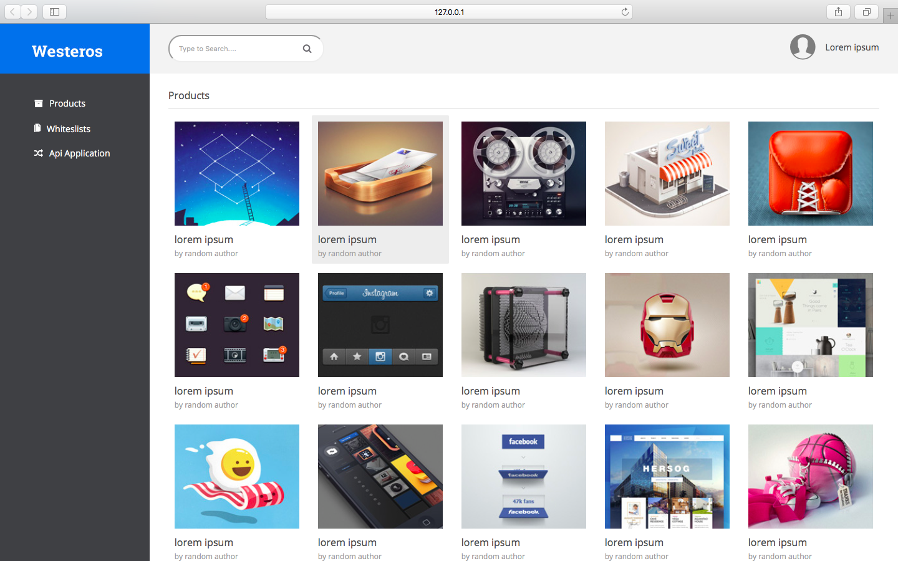
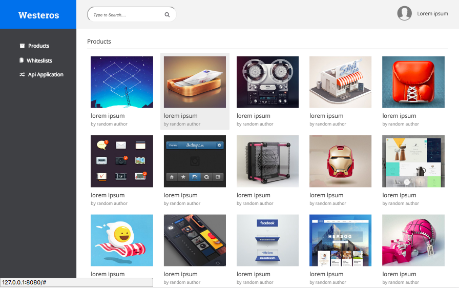
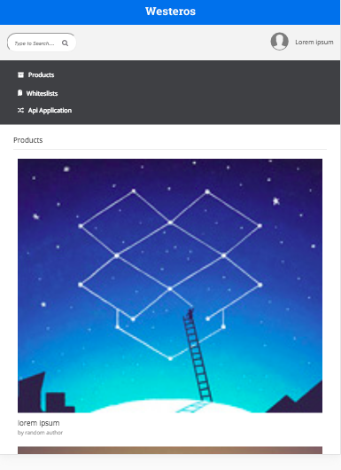
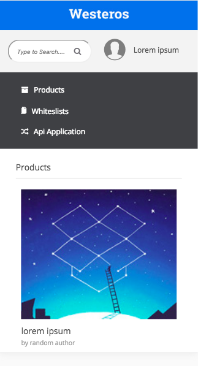

# MindValley-Westeros.github.io
<b>Task:-</b> To create a new web application as a part of MindValley assessment using HTML, CSS and React.Js.

This repository contains the Westeros web application developed as a part of Mind Valley assessment.

<b>Setps to open the web page on browser?</b>
1. Clone the current repository at any specific location on your computer.
2. Open Terminal (for mac) or command prompt (for windows).
3. Set the path to your project folder location.
4. Install the necessary packages using <b>'yarn install'</b> command.
5. Build the babel to compile React components. Use below command on your terminal window: 
      <b>yarn run build-babel</b>
6. Once compilation process is over, build the webpack, so that using all the mentioned configurations it will generate the   
   public folder and files. To do this execute below command: <b>yarn run build</b>.
7. Now, its time to run web page. For this, open another tab in your terminal window and hit this command: <b>yarn run serve</b>.
8. Web page will automatically displayed over the browser.

<b>Programming Languages Used</b>:
  1. HTML
  2. CSS
  3. SCSS
  4. React.Js

<b>Bundling Tool Used</b>: Webpack
<b>Package Manager Used</b>: Yarn

- Web Application is divided into different components. These components are built using React.Js.
Components are written using HTML like JSX.

The <b>folder structure</b> is as follows:

- dist (This folder is used for distribution purpose. All public files needs to be accessible outside are reside in this.)
    |- assets
          |- src
              |- contents
                    |- images
                          |- logo.jpg
                          |- products
                                |- product images
    |- bundle.js
    |- index.html
    |- scripts
          |- app.js
- package.json  (It includes the web application configuration.)
- src
    |- app.js
    |- components
          |- all components  (All React components are placed in this folder.)
    |- contents  (All CSS/ JavaScript/ Images will be available here.)
          |- css
              |- base
                  |- _base.scss
                  |- _settings.scss
              |- custom.scss
          |- images
              |- logo.jpg
              |- products
                    |- product images
          |- js
    |- routers
          |- AppRouter.js  (All routing configurations for the application are mentioned here.)
- webpack.config.js  (It helps to configure the loaders and other configurations required in the application.)

* Responsiveness of the application is handled by the CSS media queries whereever required.

* <b>Screenshots</b> are attached here:

<b>A. Desktop View (Without Product Highlight)</b>

<b>B. Desktop View (With Product Highlight)</b>

<b>C. Tablet View</b>

<b>D. Mobile View</b>

---------------------------------
